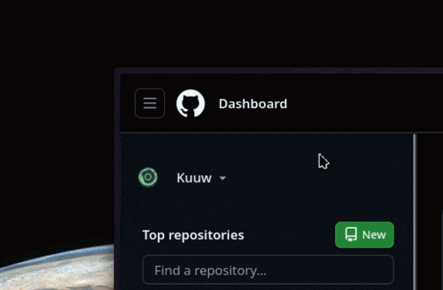

# Mercek
Mercek is a color picker with zooming capabilities.



> [!IMPORTANT]
> Mercek relies on **KDE Spectacle** for screen grabbing. Spectacle must be installed on your system.

## Prerequisites

- **Spectacle**
- **Rust toolchain**
- `make` (optional, for install scripts)

## Building
```bash
cargo build --release # or just 'make'
```

## Installing
```bash
make install
```

## Usage
```bash
mercek
```

### Controls
| Action | Key / Mouse |
| --- | --- |
| **Pick Color** | `Left Click` |
| **Adjust Zoom** | `Scroll Wheel` |
| **Exit** | `Escape` |

Selected color is copied to clipboard after clicking.

## Uninstalling
```bash
make uninstall
```

## Acknowledgments
- Color name dataset sourced from [meodai/color-names](https://github.com/meodai/color-names).

## License
Mercek is licensed under the MIT License. See the [LICENSE](LICENSE) file for details.
